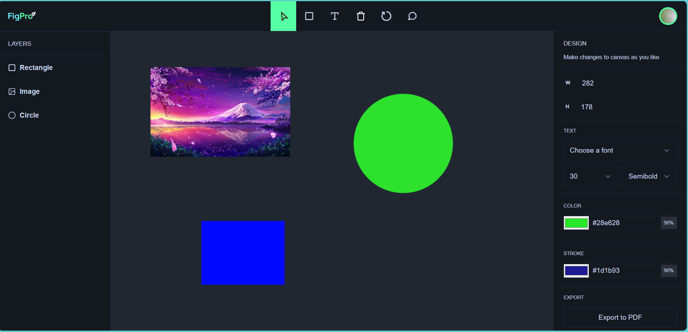

# FigPro - Collaborative Design Platform

FigPro is an innovative, real-time collaborative design platform inspired by Figma. Built using **Next.js** and powered by **Liveblocks**, it enables seamless teamwork on design projects with multiple users working simultaneously.

## 🚀 Features

- **Real-Time Collaboration**: Multiple users can work on the same design, with instant updates visible to everyone.
- **Vector Editing**: Tools to manipulate shapes, lines, and text to create complex designs.
- **Version Control**: Track and revert to previous design versions seamlessly.
- **Interactive Workspace**: An intuitive design interface with drag-and-drop functionality.
- **User Activity Tracking**: See what others are doing in real-time with user annotations and highlights.
  
## 💻 Tech Stack

- **Frontend**: React, Next.js
- **Real-Time Collaboration**: Liveblocks
- **Design Tools**: Custom-built components for vector editing, text formatting, and UI elements.

## 🌟 How It Works

1. **Start a Design**: Begin a new project or collaborate on an existing one.
2. **Invite Collaborators**: Share a link and start working with your team in real-time.
3. **Edit and Sync**: All actions are immediately reflected for all users.
4. **Version Control**: Manage your design history and revert changes if needed.

## 📷 Screenshots



## ⚙️ Setup Instructions

To run FigPro locally:

1. Clone the repository:
   ```bash
   git clone https://github.com/xing24xing/Figma.git
2. Install dependencies:
   cd figpro
   npm install
   
3. npm run dev

   🛠️ Contributions
If you'd like to contribute, feel free to fork the repo and submit a pull request! I’m happy to collaborate and improve the platform.

📬 Contact
For any inquiries, feedback, or collaboration opportunities, reach me at:

Email: xingxing8601@gmail.com
GitHub: github.com/xing24xing
🎯 What's Next?
Mobile Support: Making FigPro available on mobile platforms.
Advanced Features: Adding more design tools like prototyping and animation.
Community: Building a feedback loop with the design community for future improvements.


Here’s a sample README.md file that you can use to showcase your FigPro project in an attractive and informative way:

markdown
Copy code
# FigPro - Collaborative Design Platform

FigPro is an innovative, real-time collaborative design platform inspired by Figma. Built using **Next.js** and powered by **Liveblocks**, it enables seamless teamwork on design projects with multiple users working simultaneously.

## 🚀 Features

- **Real-Time Collaboration**: Multiple users can work on the same design, with instant updates visible to everyone.
- **Vector Editing**: Tools to manipulate shapes, lines, and text to create complex designs.
- **Version Control**: Track and revert to previous design versions seamlessly.
- **Interactive Workspace**: An intuitive design interface with drag-and-drop functionality.
- **User Activity Tracking**: See what others are doing in real-time with user annotations and highlights.
  
## 💻 Tech Stack

- **Frontend**: React, Next.js
- **Backend**: Firebase (Authentication & Database)
- **Real-Time Collaboration**: Liveblocks
- **Design Tools**: Custom-built components for vector editing, text formatting, and UI elements.

## 🌟 How It Works

1. **Start a Design**: Begin a new project or collaborate on an existing one.
2. **Invite Collaborators**: Share a link and start working with your team in real-time.
3. **Edit and Sync**: All actions are immediately reflected for all users.
4. **Version Control**: Manage your design history and revert changes if needed.

## 📷 Screenshots


## ⚙️ Setup Instructions

To run FigPro locally:

1. Clone the repository:
   ```bash
   git clone https://github.com/your-username/figpro.git
Install dependencies:

bash
Copy code
cd figpro
npm install
Set up Firebase credentials (authentication and database).

Run the app:

bash
Copy code
npm run dev
Visit http://localhost:3000 to use FigPro.

🛠️ Contributions
If you'd like to contribute, feel free to fork the repo and submit a pull request! I’m happy to collaborate and improve the platform.

📬 Contact
For any inquiries, feedback, or collaboration opportunities, reach me at:

Email: your-email@example.com
GitHub: github.com/your-username

**Feel free to explore FigPro and contribute to making it a more powerful tool for collaborative design!**


